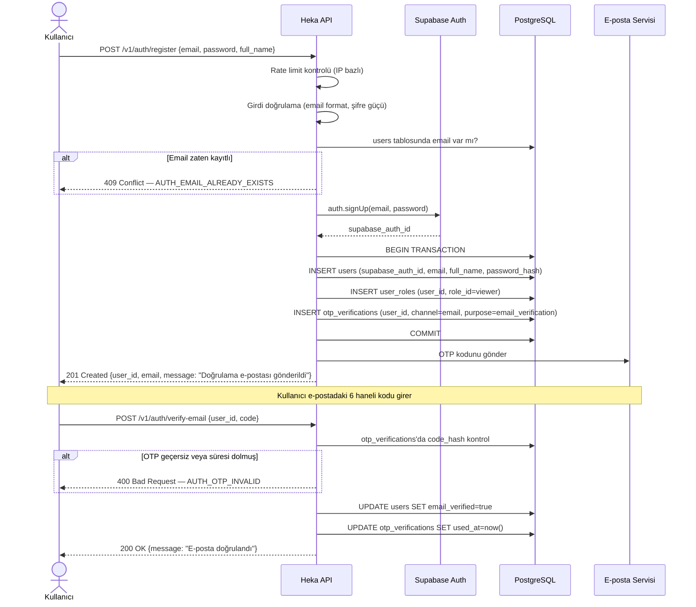
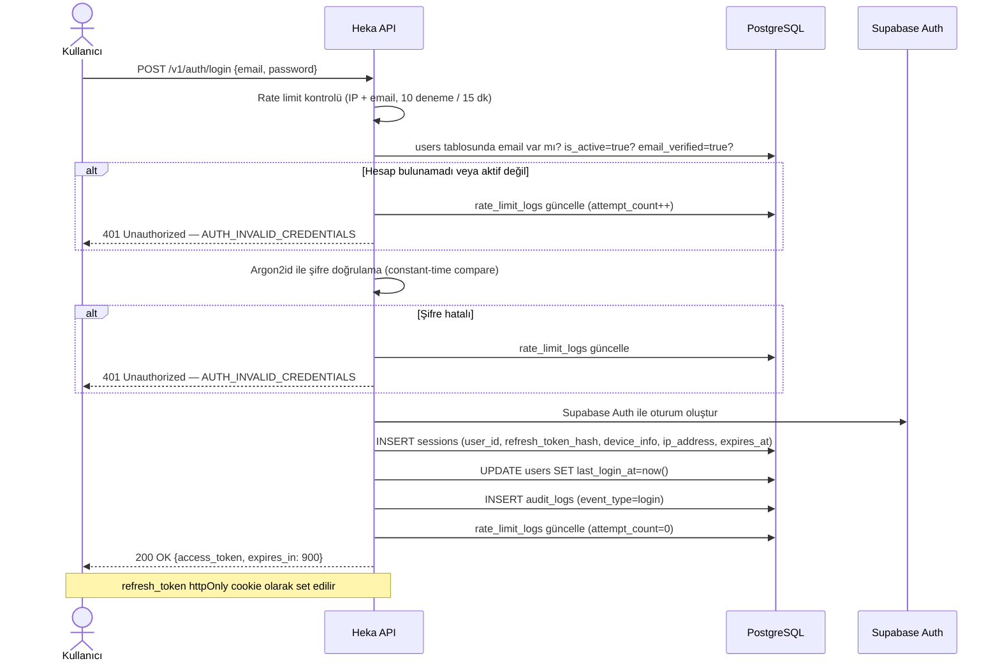
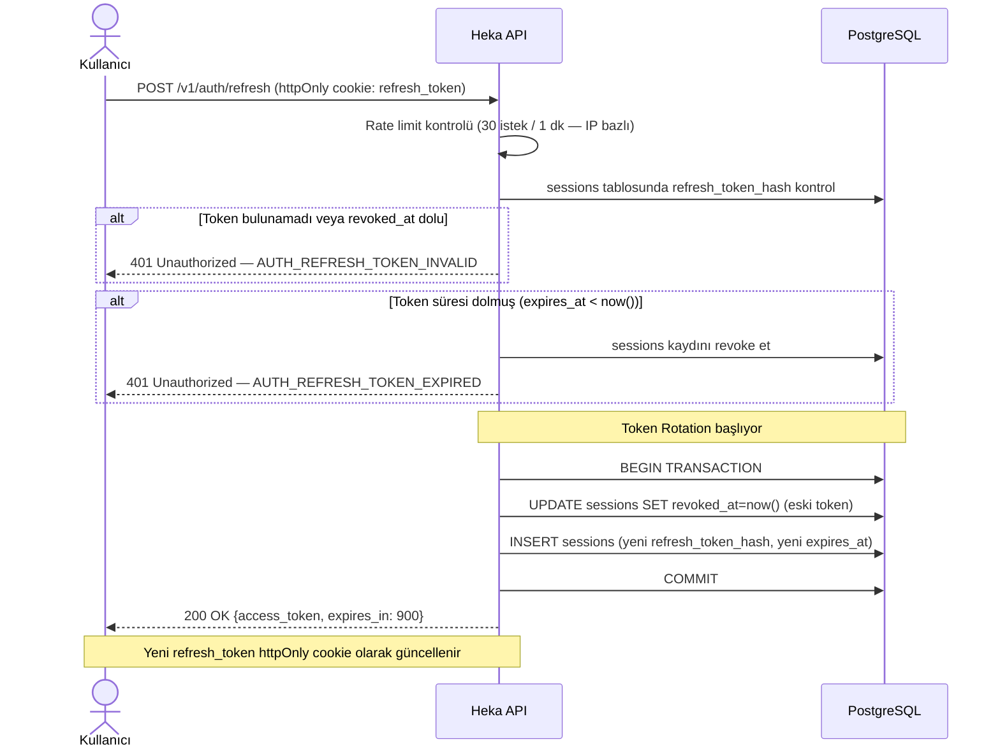
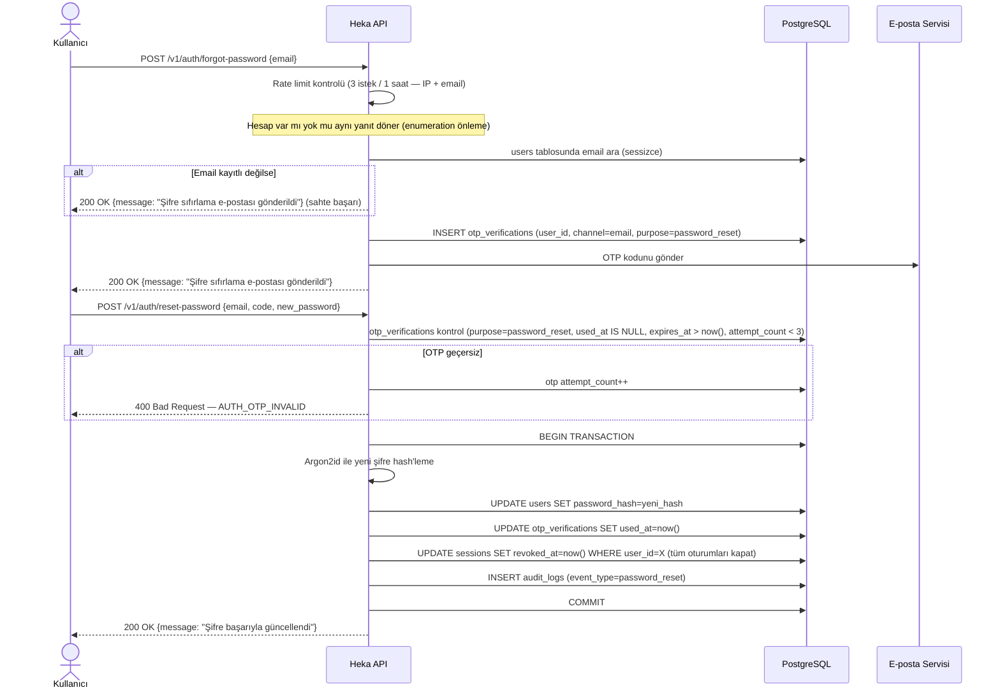
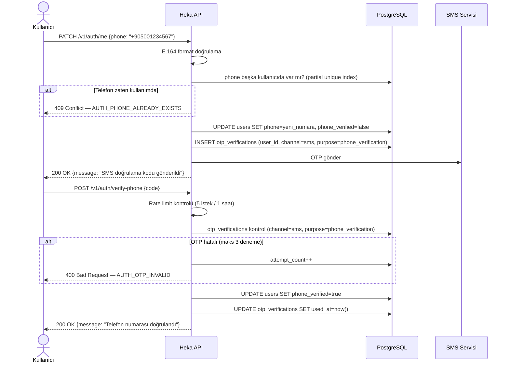
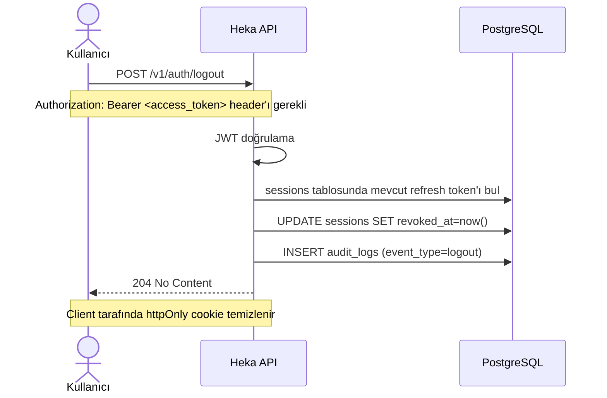
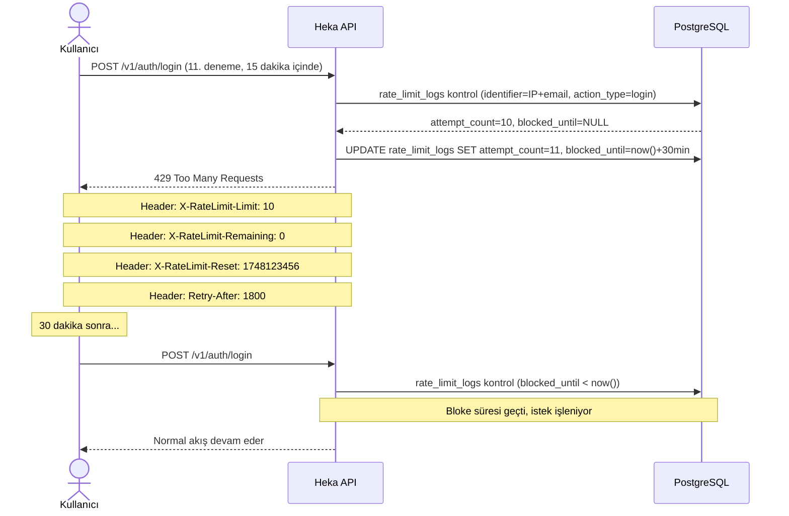

# Kimlik Doğrulama Akışları

## 1. Kayıt Akışı (Register → Email OTP → Aktif Hesap)

---

## 2. Giriş Akışı (Login → Access Token + Refresh Token)

---

## 3. Token Yenileme Akışı (Refresh → Yeni Access Token)

---

## 4. Şifre Sıfırlama Akışı (Forgot → OTP → Reset)

---

## 5. Telefon Doğrulama Akışı (SMS OTP)

---

## 6. Çıkış Akışı (Logout → Token İptal)

---

## 7. Rate Limit Aşımı Durumu

---

## Genel Güvenlik Notları

| Durum | Davranış |
|---|---|
| Var olmayan e-posta ile login | Mevcut hesapla aynı hata mesajı (enumeration önleme) |
| Var olmayan e-posta ile forgot-password | Sahte başarı yanıtı |
| Doğrulanmamış e-posta ile login | 403 döner; doğrulama tamamlanması istenir |
| Devre dışı hesapla login | 403 döner; genel mesaj |
| Şüpheli token rotation (eski token tekrar kullanımı) | Tüm kullanıcı oturumları iptal edilir |
