# Veritabani Semasi Genel Bakis

## Tum Tablolar ve Kisa Aciklamalari

### core (Kavramsal Modul — Ortak Kurallar)

Bu modul fiziksel bir tablo olmaktan cok bir kural seti ve sozlesme belirleme moduludur. Tum ana tablolarin uyacagi standartlari tanimlar.

---

### auth Modulu

| Tablo | Amac |
|---|---|
| `users` | Sisteme kayitli tum kullanicilari tutar. Supabase Auth ile eslestirilen kimlik bilgileri burada genisletilir. |
| `roles` | Sistem rolleri (admin, manager, viewer, vb.) tanimlanir. |
| `permissions` | Atomik izin tanimlari (ornegin: product.create, catalog.read). |
| `user_roles` | Kullanici-rol coka-cok iliskisi. |
| `role_permissions` | Rol-izin coka-cok iliskisi. |
| `sessions` | Aktif kullanici oturumlari, refresh token ve son erisim zamani. |
| `otp_verifications` | E-posta ve SMS OTP dogrulama kayitlari. |
| `rate_limit_logs` | Login, OTP, sifre sifirlama gibi hassas islemlerin rate limit takibi. |

---

### product Modulu

| Tablo | Amac |
|---|---|
| `brands` | Urun markalari. |
| `categories` | Urun kategorileri, oz-referansli hiyerarsik yapi. |
| `products` | Ana urun kaydini tutar; kod, marka, kategori, durum bilgileri. |
| `product_technical_details` | Voltaj, guc, renk sicakligi gibi teknik ozellikler; bire-bir iliskiyle urunle baglidir. |
| `product_display` | Ambalaj, kutu boyutu, agirlik, barkod, QR, sertifikalar gibi gorunum/lojistik verisi. |

---

### catalog Modulu

| Tablo | Amac |
|---|---|
| `catalogs` | Urun kataloglari; aktif/pasif durumu ve gecerlilik tarihleri. |
| `catalog_items` | Katalogtaki urunler ve katalog icindeki siralama. |
| `pricing` | Urun/katalog bazli fiyat tanimlari; para birimi ve gecerlilik araligi. |

---

### files Modulu

| Tablo | Amac |
|---|---|
| `files` | Supabase Storage'a yuklenen dosyalarin metadata kaydini tutar. |
| `file_relations` | Dosyayi herhangi bir kayda (urun, katalog, vb.) polimorfik olarak baglayan iliski tablosu. |

---

### audit Modulu

| Tablo | Amac |
|---|---|
| `audit_logs` | Login, update, delete, permission change gibi tum kritik olaylarin degismez kaydi. |

---

## Modullere Gore Tablo Sayisi Ozeti

| Modul | Tablo Sayisi |
|---|---|
| auth | 8 |
| product | 5 |
| catalog | 3 |
| files | 2 |
| audit | 1 |
| **Toplam** | **19** |

---

## Tablolar Arasi Iliski Diyagrami (Mermaid ERD)

```mermaid
erDiagram

    %% AUTH
    users {
        uuid id PK
        uuid supabase_auth_id UK
        string email UK
        string phone
        string password_hash
        boolean email_verified
        boolean phone_verified
        timestamp deleted_at
    }

    roles {
        uuid id PK
        string name UK
        string description
    }

    permissions {
        uuid id PK
        string code UK
        string description
    }

    user_roles {
        uuid user_id FK
        uuid role_id FK
    }

    role_permissions {
        uuid role_id FK
        uuid permission_id FK
    }

    sessions {
        uuid id PK
        uuid user_id FK
        string refresh_token UK
        timestamp expires_at
        timestamp last_active_at
    }

    otp_verifications {
        uuid id PK
        uuid user_id FK
        string channel
        string code_hash
        timestamp expires_at
        boolean used
    }

    rate_limit_logs {
        uuid id PK
        string identifier
        string action_type
        int attempt_count
        timestamp window_start
        timestamp blocked_until
    }

    %% PRODUCT
    brands {
        uuid id PK
        string name UK
        string slug UK
    }

    categories {
        uuid id PK
        uuid parent_id FK
        string name
        string slug UK
    }

    products {
        uuid id PK
        string code UK
        uuid brand_id FK
        uuid category_id FK
        string status
        timestamp deleted_at
    }

    product_technical_details {
        uuid id PK
        uuid product_id FK
        string socket_type
        string voltage
        decimal power_w
        decimal light_lm
        int color_temp_k
        boolean dimmable
        string energy_class
        int lifetime_hours
    }

    product_display {
        uuid id PK
        uuid product_id FK
        int package_qty
        string box_size
        decimal box_weight_gr
        string barcode UK
        string qr_code
        jsonb certificates
    }

    %% CATALOG
    catalogs {
        uuid id PK
        string name
        string status
        date valid_from
        date valid_to
        timestamp deleted_at
    }

    catalog_items {
        uuid id PK
        uuid catalog_id FK
        uuid product_id FK
        int sort_order
    }

    pricing {
        uuid id PK
        uuid product_id FK
        uuid catalog_id FK
        decimal price
        string currency
        date valid_from
        date valid_to
    }

    %% FILES
    files {
        uuid id PK
        string bucket_name
        string storage_path UK
        string original_filename
        string mime_type
        bigint size_bytes
        uuid uploaded_by FK
        timestamp deleted_at
    }

    file_relations {
        uuid id PK
        uuid file_id FK
        string entity_type
        uuid entity_id
        string relation_type
        int sort_order
    }

    %% AUDIT
    audit_logs {
        uuid id PK
        uuid user_id FK
        string event_type
        string entity_type
        uuid entity_id
        jsonb old_data
        jsonb new_data
        string ip_address
        string user_agent
        timestamp created_at
    }

    %% ILISKILER
    users ||--o{ user_roles : "sahip olur"
    roles ||--o{ user_roles : "atanir"
    roles ||--o{ role_permissions : "icerir"
    permissions ||--o{ role_permissions : "sahip olur"
    users ||--o{ sessions : "olusturur"
    users ||--o{ otp_verifications : "alir"

    brands ||--o{ products : "sahip olur"
    categories ||--o{ products : "siniflandirir"
    categories ||--o| categories : "parent"
    products ||--|| product_technical_details : "bir-bir"
    products ||--|| product_display : "bir-bir"

    catalogs ||--o{ catalog_items : "icerir"
    products ||--o{ catalog_items : "listelenir"
    products ||--o{ pricing : "fiyatlanir"
    catalogs ||--o{ pricing : "fiyatlanir"

    files ||--o{ file_relations : "iliskilendirilir"
    users ||--o{ files : "yukler"

    users ||--o{ audit_logs : "olusturur"
```

---

## Genel Tasarim Kararlari

1. **UUID v4** tum ana tablolarda primary key olarak kullanilir. Sira tahmini ve enumeration saldirilarina karsi guvenlidir.
2. **Soft delete** `deleted_at TIMESTAMPTZ NULL` kolonu ile uygulanir. NULL ise kayit aktif, dolu ise silinmis sayilir.
3. **created_at / updated_at** tum ana tablolarda zorunludur; trigger ile otomatik guncellenir.
4. **RLS** her tablo icin ayri olarak tanimlanir ve varsayilan olarak "erisim yok" prensibi benimsenir.
5. **product_technical_details** ve **product_display** kasitli olarak `products` tablosundan ayrilmistir; bu sayede teknik veri ile lojistik/gorunum verisi bagimsiz olarak guncellenebilir ve sorgulanabilir.
